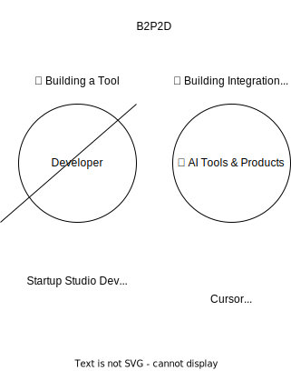
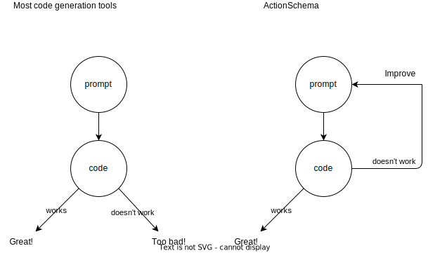

<!-- notes july 17th, 2024 (milan/maarten/wijnand meeting 1)

Problem: Dieper er op in gaan in slide
Van 1% naar 10%?

Maarten volgende week Nexler + AI-IFY + Milan

Maak een demo van het aanmaken van een nieuwe app

INVESTOR DEMO

CUSTOMER DEMO

- Werken met klant data: CSV, excel, DBs, CRM

USER/DEV DEMO

- ActionSchema Data: nieuwe api -> nieuwe frontend met claude

-->

#

<svg style="width:300px;height:300px; color:lightgreen;" xmlns="http://www.w3.org/2000/svg" viewBox="0 0 100 100"><path d="M10 90 L50 10 L90 90 M50 75 A5 5 0 1 1 50 85 A5 5 0 1 1 50 75" stroke="currentColor" stroke-width="8" fill="none" /></svg>

## **10X Reduced Time To Market for Tech Startups**

# Quality Software is Hard

- Highly Custom Tech Products have Long Time to market and are expensive to build.
- No-code solutions have hard limits in its capability, security, scalability, vendor lock-in, and lack of ownership.

# ActionSchema writes code developers love

Our AI SWE writes highly reliable and secure production code.

#

# Customer: Companies Building Tools

# Product: Iteration

# Product: Docs RAG

# Product: Scalable Deployment

# Competitors & Potential Partners

- Anysphere - Cursor (Raised 8M from OpenAI, October 2023)
- Cognition Labs - Devin (Valued at 2B at 175M fundraise April 2024)
- Magic.dev - (Looking for 1.5B valuation for 200M funding, July 2024)
- GitHub Copilot - 1M+ users
- ...many more...

<!-- #

AI with tools (GPTs, Claude Artifacts, Rabbit R1)

- B2C
- Low scale & capability
- Low cost & learning curve

AI no-code solutions (Zapier, Make.com)

- B2B
- Medium scale & medium capability
- Medium cost & learning curve

AI Agent Framework/Tool (LangChain, Crew.ai, Jina.ai, Firecrawl.dev)

- B2D
- Prod-time SDK's/API's
- On-site Expert required

Classical Software Developer + AI coding (devin, github co-pilot)

- B2D
- Increased developer productivity
- Dev-time tools
- High scale & capability
- On-site Expert required

The "AI SWE" category (AI Software Engineer) is a mixture between this...

- B2D
- Reduced time to market
- Reduced development capacity required
- Build highly scalable products (both agents and apps)
- Both dev-time tools and prod-time SDK/API gateway

# What we don't do

- ❌ Complex vision-based browser/gui automation
- ❌ Hyperpersonalised AI system
- ❌ Fancy GUIs to drag & drop your automations
- ❌ No-code that creates proprietary locked-in system

# What we do

- ✅ API-based Program Search & Composition
- ✅ Modular Systems Created in English
- ✅ Scalable Deployment
- ✅ Enterprise-grade Security -->

# Our Mission

> "As accessible as Zapier, as scalable as the product you’d get from a software development startup studio"

# Traction

**2023**:

- Built & Launched v0 with €2000 ATTR
- Talked with 50+ software developers, startup founders, software agency owners

**2024 - Q1 + Q2**

- 50+ stars on GitHub
- Onboarded 5 Companies ready for pilot with their developers

# GTM

**2024 - Q3 + Q4**

- Launch Free Demo at https://actionschema.com
- Create buzz by blogs and social media
- Retain thousands of users

**2025**

- Onboard first enterprise customer
