#

<svg style="width:300px;height:300px; color:lightgreen;" xmlns="http://www.w3.org/2000/svg" viewBox="0 0 100 100"><path d="M10 90 L50 10 L90 90 M50 75 A5 5 0 1 1 50 85 A5 5 0 1 1 50 75" stroke="currentColor" stroke-width="8" fill="none" /></svg>

## **10X Reduced Time To Market for Tech Startups**

# Quality Software is Hard

- No-code solutions have hard limits in its capability, security, scalability, vendor lock-in, and lack of ownership.
- Highly Custom Tech Products have Long Time to market and are expensive to build.

# ActionSchema makes it as easy as ABC

In order to get the best of both worlds, we created an **AI SWE that can create, deploy, and maintain scalable systems, built using code that developers love**. This will reduce the cost of useful systems 100X.

#

# Customer: Startup Studio

# Product: Iteration

# Product: Docs RAG

# Product: Scalable Deployment

# Competitors & Potential Partners

- Anysphere - Cursor (Raised 8M from OpenAI, October 2023)
- Cognition Labs - Devin (Valued at 2B at 175M fundraise April 2024)
- Magic.dev - (Looking for 1.5B valuation for 200M funding, July 2024)
- GitHub Copilot - 1M+ users
- ...many more...

<!-- #

AI with tools (GPTs, Claude Artifacts, Rabbit R1)

- B2C
- Low scale & capability
- Low cost & learning curve

AI no-code solutions (Zapier, Make.com)

- B2B
- Medium scale & medium capability
- Medium cost & learning curve

AI Agent Framework/Tool (LangChain, Crew.ai, Jina.ai, Firecrawl.dev)

- B2D
- Prod-time SDK's/API's
- On-site Expert required

Classical Software Developer + AI coding (devin, github co-pilot)

- B2D
- Increased developer productivity
- Dev-time tools
- High scale & capability
- On-site Expert required

The "AI SWE" category (AI Software Engineer) is a mixture between this...

- B2D
- Reduced time to market
- Reduced development capacity required
- Build highly scalable products (both agents and apps)
- Both dev-time tools and prod-time SDK/API gateway -->

# What we don't do

- ❌ Complex vision-based browser/gui automation
- ❌ Hyperpersonalised AI system
- ❌ Fancy GUIs to drag & drop your automations
- ❌ No-code that creates proprietary locked-in system

# What we do

- ✅ API-based Program Search & Composition
- ✅ Modular Systems Created in English
- ✅ Scalable Deployment
- ✅ Enterprise-grade Security

# Our Mission

"As accessible as Zapier, as scalable as the product you’d get from a software development startup studio"

# Go-to-Market

- Talked with 50+ software developers, startup founders, software agency owners
- 50+ stars on GitHub
- Onboarded 5 Companies ready for pilot with their developers
